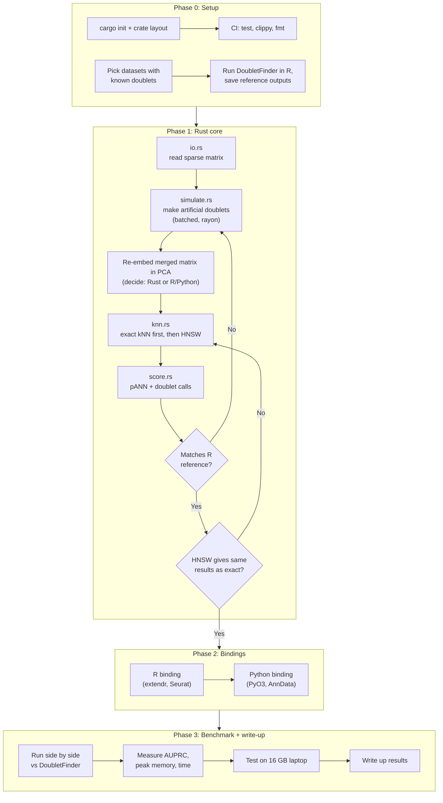

# doublet-rs

> 🚧 **Status: In progress.** This project is in the planning and early development stage. No benchmarks yet; this README describes the design and roadmap.

A memory-efficient Rust reimplementation of the [DoubletFinder](https://github.com/chris-mcginnis-ucsf/DoubletFinder) core engine for detecting doublets in single-cell RNA-seq data, with bindings for R and Python.

## Why

DoubletFinder performs strongly in independent doublet-detection benchmarks, but it is memory-hungry. It has been reported to fail on 16GB laptops and to need 64GB+ servers for large datasets.

The bottleneck isn't the algorithm; it's how intermediate data is handled. Real cells, simulated doublets, and the merged PCA space get copied repeatedly. Rust's ownership model (borrow instead of copy), sparse matrices, and batched processing target that problem directly.

**Goal:** match DoubletFinder's accuracy while running on commodity hardware.

## How DoubletFinder works

1. Start from a normalized, QC'd gene × cell matrix
2. Run PCA on the real cells
3. Simulate artificial doublets by averaging randomly paired cells
4. Merge real cells and artificial doublets
5. Re-embed the merged matrix in PCA space
6. Find each real cell's *k* nearest neighbours
7. Score each cell by **pANN**, the proportion of its neighbours that are artificial doublets
8. Call the top `expected_doublet_rate × n_cells` as doublets

Steps 3, 5, and 6 are where memory and time blow up.

## What moves to Rust

| Step | Rust approach |
|---|---|
| Doublet simulation | Batched generation with `rayon`, streamed instead of materialized all at once |
| kNN search | HNSW approximate-nearest-neighbour index (`hnsw_rs`), queried in parallel |
| pANN scoring & thresholding | Parallel per-cell reduction, no round-trips back to R |

**Stays in R/Python:** normalization and QC (Seurat / Scanpy), initial PCA (`irlba`), and visualization.

## Design

- **Expression matrix:** sparse (`sprs`), since scRNA-seq matrices are typically over 90% zeros
- **PCA embedding:** dense `ndarray::Array2<f64>` (cells × ~30 PCs)
- **kNN index:** `hnsw_rs::Hnsw`, built once on the merged embedding and read concurrently

### Planned crate structure

```
doublet-rs/
├── Cargo.toml
├── src/
│   ├── lib.rs        # public API
│   ├── simulate.rs   # artificial doublet generation
│   ├── knn.rs        # ANN index build + query
│   ├── score.rs      # pANN + thresholding
│   └── io.rs         # dense + sparse matrix I/O
├── bindings/
│   ├── r/            # extendr wrapper
│   └── python/       # PyO3 wrapper (optional)
└── benches/
    └── vs_doubletfinder.rs
```

### Planned API

The R binding (via `extendr`) is meant to drop into an existing Seurat workflow:

```r
doublets <- simulate_doublets(expr, n = 0.25 * ncol(expr))
index    <- build_knn_index(merged_pcs)
pann     <- compute_pann(index, k = 30)
```

A PyO3 binding with the same API is planned for Scanpy / AnnData users.

## Validation plan

1. Use public scRNA-seq datasets with annotated ground-truth doublets
2. Run DoubletFinder (R) and doublet-rs side by side
3. Compare:
   - **Accuracy:** AUPRC against ground truth
   - **Peak memory:** the headline metric
   - **Wall-clock time**

## Roadmap

### Build plan



### Checklist

- [x] Sparse matrix I/O
- [x] Artificial doublet simulation (batched, parallel)
- [x] HNSW kNN index + parallel queries
- [x] pANN scoring + thresholding
- [ ] Validate core against DoubletFinder reference outputs
- [ ] R binding (extendr)
- [ ] Python binding (PyO3)
- [ ] Benchmark suite vs. DoubletFinder
- [ ] Write-up of results

## Acknowledgements

Based on the DoubletFinder method:

> McGinnis CS, Murrow LM, Gartner ZJ (2019). *DoubletFinder: Doublet Detection in Single-Cell RNA Sequencing Data Using Artificial Nearest Neighbors.* Cell Systems.

This is an independent reimplementation and is not affiliated with the original authors.

## Author

**Mayank Gandhi**, MS Bioinformatics, Northeastern University
[LinkedIn](https://www.linkedin.com/in/mayankgandhi0713) · [GitHub](https://github.com/mayankgandhi13)
