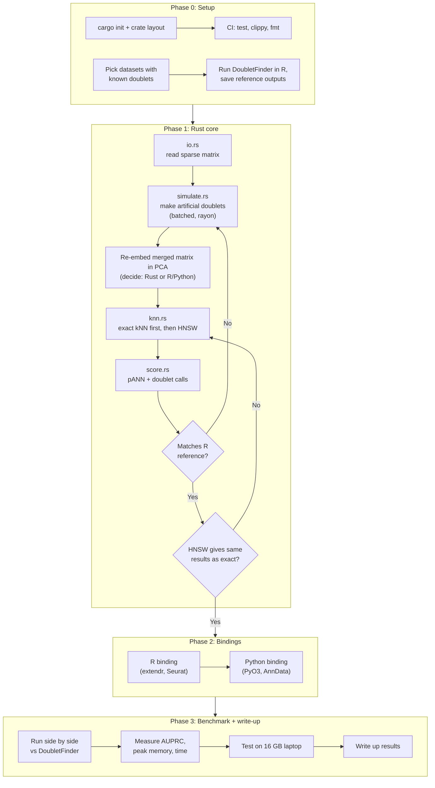

# doublet-rs

> 🚧 **Status: In progress.** The Rust core and R binding work, and reproduce DoubletFinder's scores exactly on 16 benchmark datasets (see [Validation](#validation)). Memory benchmarks are next.

A memory-efficient Rust reimplementation of the [DoubletFinder](https://github.com/chris-mcginnis-ucsf/DoubletFinder) core engine for detecting doublets in single-cell RNA-seq data, with bindings for R and Python.

## Why

DoubletFinder performs strongly in independent doublet-detection benchmarks, but it is memory-hungry. It has been reported to fail on 16GB laptops and to need 64GB+ servers for large datasets.

The bottleneck isn't the algorithm; it's how intermediate data is handled. Real cells, simulated doublets, and the merged PCA space get copied repeatedly. Rust's ownership model (borrow instead of copy), sparse matrices, and batched processing target that problem directly.

**Goal:** match DoubletFinder's accuracy while running on commodity hardware.

## How DoubletFinder works

1. Start from a normalized, QC'd gene × cell matrix
2. Run PCA on the real cells
3. Simulate artificial doublets by averaging randomly paired cells
4. Merge real cells and artificial doublets
5. Re-embed the merged matrix in PCA space
6. Find each real cell's *k* nearest neighbours
7. Score each cell by **pANN**, the proportion of its neighbours that are artificial doublets
8. Call the top `expected_doublet_rate × n_cells` as doublets

Steps 3, 5, and 6 are where memory and time blow up.

## What moves to Rust

| Step | Rust approach |
|---|---|
| Doublet simulation | Batched generation with `rayon`, streamed instead of materialized all at once |
| kNN search | Exact search, parallel over cells with `rayon`, without DoubletFinder's dense cells × cells distance matrix |
| pANN scoring & thresholding | Parallel per-cell reduction, no round-trips back to R |

**Stays in R/Python:** normalization and QC (Seurat / Scanpy), initial PCA (`irlba`), and visualization.

## Design

- **Expression matrix:** sparse (`sprs`), since scRNA-seq matrices are typically over 90% zeros
- **PCA embedding:** dense `ndarray::Array2<f64>` (cells × ~30 PCs)
- **kNN search:** exact, parallel brute force over the embedding. An HNSW index (`hnsw_rs`) is available behind the `hnsw` cargo feature, but was slower on every benchmark dataset

### Planned crate structure

```
doublet-rs/
├── Cargo.toml
├── src/
│   ├── lib.rs        # public API
│   ├── simulate.rs   # artificial doublet generation
│   ├── knn.rs        # ANN index build + query
│   ├── score.rs      # pANN + thresholding
│   └── io.rs         # dense + sparse matrix I/O
├── bindings/
│   ├── r/            # extendr wrapper
│   └── python/       # PyO3 wrapper (optional)
└── benches/
    └── vs_doubletfinder.rs
```

### R API

The R package `doubletrs` (in `bindings/r/`, built with `extendr`) fits into an existing Seurat workflow. Normalization and PCA stay in Seurat; Rust does the simulation and neighbour search:

```r
library(doubletrs)

n_real   <- ncol(counts)                                          # dgCMatrix, genes x cells
doublets <- simulate_doublets(counts, n = round(n_real / 0.75 - n_real))  # pN = 0.25
merged   <- cbind(counts, doublets)

# ...normalize + PCA on `merged` with Seurat -> `pcs` (cells x PCs, real cells first)...

pann     <- compute_pann(pcs, n_real = n_real, k = round(nrow(pcs) * 0.09))  # pK = 0.09
calls    <- rank(-pann, ties.method = "first") <= round(0.075 * n_real)       # 7.5% doublet rate
```

`find_neighbors()` returns the neighbour indices themselves. Every function takes a `threads` argument, defaulting to `doubletrs_threads()` (all cores, or `options(doubletrs.threads = n)`).

To install from a clone (needs Rust >= 1.71):

```sh
R CMD INSTALL bindings/r
```

`scripts/build-r-package.sh` builds the self-contained CRAN tarball in `dist/`, with the core crate bundled and all Rust dependencies vendored for an offline build.

A PyO3 binding with the same API is planned for Scanpy / AnnData users.

## Validation

doublet-rs was compared with DoubletFinder on all 16 real datasets from the Xi & Li (2021) doublet-detection benchmark, which have experimentally identified doublets (cell hashing, demuxlet, MULTI-seq, species mixing). Each dataset was run with 3 seeds, using pN = 0.25, pK = 0.09, 10 PCs, and default Seurat preprocessing.

**Exactness.** Given the same merged PCs DoubletFinder used, doublet-rs reproduces its pANN for **504,717 / 504,717 cells** (every cell, every dataset, every seed), with a maximum difference of 0 and identical doublet calls in all 48 runs.

**Accuracy.** Run end to end (Rust doublet simulation, same Seurat preprocessing, Rust kNN), accuracy against the known doublets is the same as DoubletFinder's. Per-dataset differences are within seed-to-seed variation.

| Mean over 16 datasets | DoubletFinder | doublet-rs (exact) | doublet-rs (HNSW) |
|---|---|---|---|
| AUPRC | 0.412 | 0.413 | 0.413 |
| AUROC | 0.736 | 0.740 | 0.739 |
| Precision at true doublet count | 0.427 | 0.425 | 0.424 |

<details>
<summary>AUPRC per dataset, mean (sd) over 3 seeds</summary>

| Dataset | Cells | DoubletFinder | doublet-rs (exact) | doublet-rs (HNSW) |
|---|---|---|---|---|
| J293t-dm | 500 | 0.216 (0.004) | 0.230 (0.015) | 0.230 (0.015) |
| pbmc-1A-dm | 3,298 | 0.203 (0.012) | 0.194 (0.019) | 0.194 (0.017) |
| pbmc-1B-dm | 3,790 | 0.128 (0.003) | 0.134 (0.009) | 0.134 (0.009) |
| pbmc-1C-dm | 5,270 | 0.263 (0.005) | 0.261 (0.008) | 0.260 (0.007) |
| nuc-MULTI | 5,578 | 0.252 (0.007) | 0.264 (0.003) | 0.264 (0.003) |
| hm-6k | 6,806 | 0.980 (0.002) | 0.980 (0.002) | 0.980 (0.002) |
| cline-ch | 7,954 | 0.378 (0.001) | 0.377 (0.002) | 0.377 (0.002) |
| pdx-MULTI | 10,296 | 0.256 (0.001) | 0.260 (0.002) | 0.260 (0.002) |
| HMEC-rep-MULTI | 10,580 | 0.586 (0.003) | 0.590 (0.003) | 0.589 (0.003) |
| HEK-HMEC-MULTI | 10,641 | 0.451 (0.001) | 0.447 (0.001) | 0.447 (0.002) |
| hm-12k | 12,820 | 0.986 (0.001) | 0.986 (0.001) | 0.987 (0.001) |
| pbmc-2ctrl-dm | 13,913 | 0.314 (0.008) | 0.310 (0.012) | 0.309 (0.011) |
| pbmc-2stim-dm | 13,916 | 0.298 (0.007) | 0.301 (0.011) | 0.300 (0.012) |
| pbmc-ch | 15,272 | 0.404 (0.006) | 0.406 (0.002) | 0.406 (0.003) |
| mkidney-ch | 21,179 | 0.448 (0.001) | 0.448 (0.001) | 0.447 (0.002) |
| HMEC-orig-MULTI | 26,426 | 0.425 (0.002) | 0.427 (0.000) | 0.426 (0.001) |

</details>

**Speed.** End to end, doublet-rs is 1.5 to 4 times faster. Most of the remaining time is Seurat preprocessing, which both tools share; the step doublet-rs replaces (DoubletFinder's dense distance matrix and per-cell sorting) is roughly 10 to 20 times faster:

| Dataset | Cells | DoubletFinder total | doublet-rs total | Replaced step: DoubletFinder | Replaced step: doublet-rs |
|---|---|---|---|---|---|
| pbmc-ch | 15,272 | 39 s | 10 s | ~32 s | 1.8 s |
| mkidney-ch | 21,179 | 91 s | 31 s | ~68 s | 3.5 s |
| HMEC-orig-MULTI | 26,426 | 202 s | 79 s | ~118 s | 11 s |

HNSW is *slower* than exact search at these sizes (45 s vs 11 s on HMEC-orig-MULTI): with 10 PCs and up to ~35k points, parallel brute force is already fast and building the index costs more than it saves. Exact search is the better default below very large datasets.

**Caveats.** Parameters were fixed rather than tuned per dataset (Xi & Li used DoubletFinder's pK sweep), so absolute AUPRC values differ from the paper; the comparison between the two tools is like for like. Timings are single runs on a shared cluster with mixed node types, so treat them as approximate. Peak memory was not compared here, because both tools ran in the same process; that is the next step.

To reproduce, see [validation/](validation/): `fetch_dataset.py` downloads datasets, `compare_doubletfinder.R` runs one dataset, `hpc/` has the Slurm scripts used on Northeastern's Explorer cluster, and `summarize.R` builds the tables. Raw per-run results are in [validation/results/](validation/results/).

## Roadmap

### Build plan


```mermaid
flowchart TD
    subgraph P0["Phase 0: Setup"]
        direction LR
        A1["cargo init + crate layout"] --> A2["CI: test, clippy, fmt"]
        A3["Pick datasets with<br/>known doublets"] --> A4["Run DoubletFinder in R,<br/>save reference outputs"]
    end

    subgraph P1["Phase 1: Rust core"]
        B1["io.rs<br/>read sparse matrix"] --> B2["simulate.rs<br/>make artificial doublets<br/>(batched, rayon)"]
        B2 --> B3["Re-embed merged matrix in PCA<br/>(decide: Rust or R/Python)"]
        B3 --> B4["knn.rs<br/>exact kNN first, then HNSW"]
        B4 --> B5["score.rs<br/>pANN + doublet calls"]
        B5 --> V1{"Matches R<br/>reference?"}
        V1 -- No --> B2
        V1 -- Yes --> V2{"HNSW gives same<br/>results as exact?"}
        V2 -- No --> B4
    end

    subgraph P2["Phase 2: Bindings"]
        direction LR
        C1["R binding<br/>(extendr, Seurat)"] --> C2["Python binding<br/>(PyO3, AnnData)"]
    end

    subgraph P3["Phase 3: Benchmark + write-up"]
        direction LR
        E1["Run side by side<br/>vs DoubletFinder"] --> E2["Measure AUPRC,<br/>peak memory, time"]
        E2 --> E3["Test on 16 GB laptop"] --> E4["Write up results"]
    end

    P0 --> P1
    V2 -- Yes --> P2
    P2 --> P3
```

### Checklist

- [x] Sparse matrix I/O
- [x] Artificial doublet simulation (batched, parallel)
- [x] HNSW kNN index + parallel queries
- [x] pANN scoring + thresholding
- [x] Validate core against DoubletFinder reference outputs
- [x] R binding (extendr)
- [ ] Python binding (PyO3)
- [ ] Benchmark suite vs. DoubletFinder
- [ ] Write-up of results

## Acknowledgements

Based on the DoubletFinder method:

> McGinnis CS, Murrow LM, Gartner ZJ (2019). *DoubletFinder: Doublet Detection in Single-Cell RNA Sequencing Data Using Artificial Nearest Neighbors.* Cell Systems.

This is an independent reimplementation and is not affiliated with the original authors.

## Author

**Mayank Gandhi**, MS Bioinformatics, Northeastern University
[LinkedIn](https://www.linkedin.com/in/mayankgandhi0713) · [GitHub](https://github.com/mayankgandhi13)
